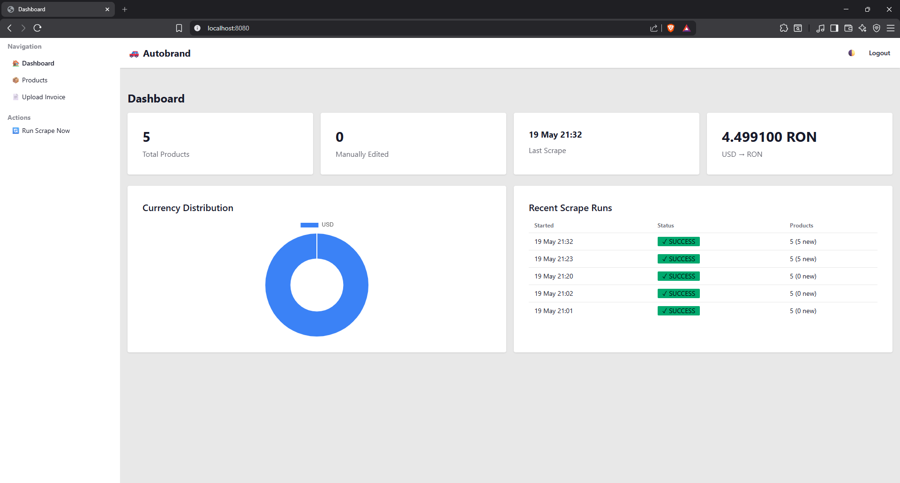
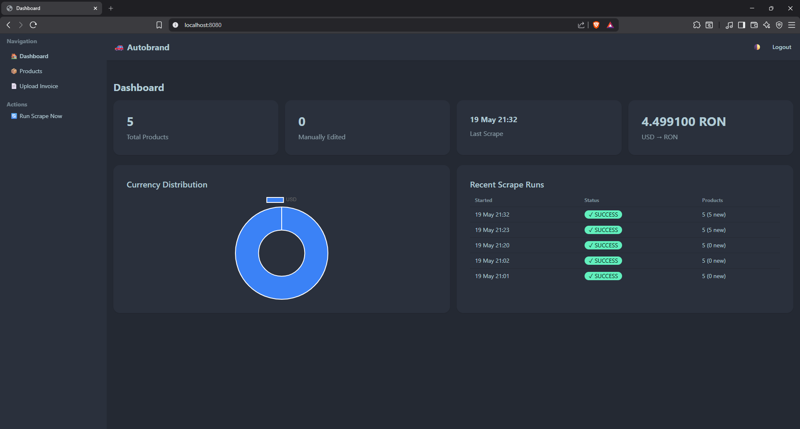
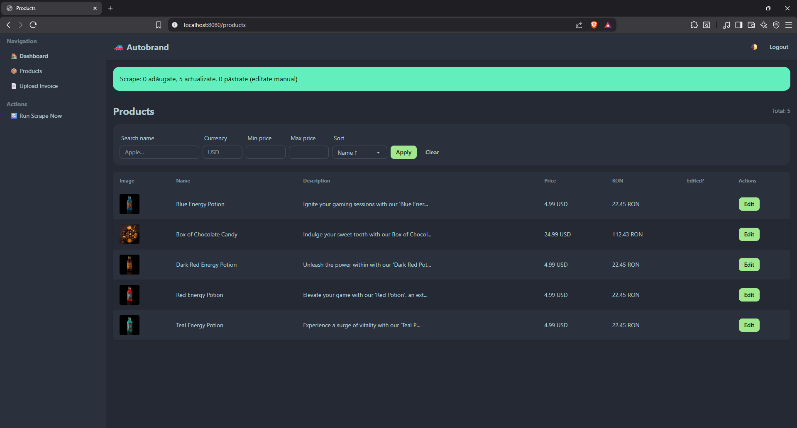
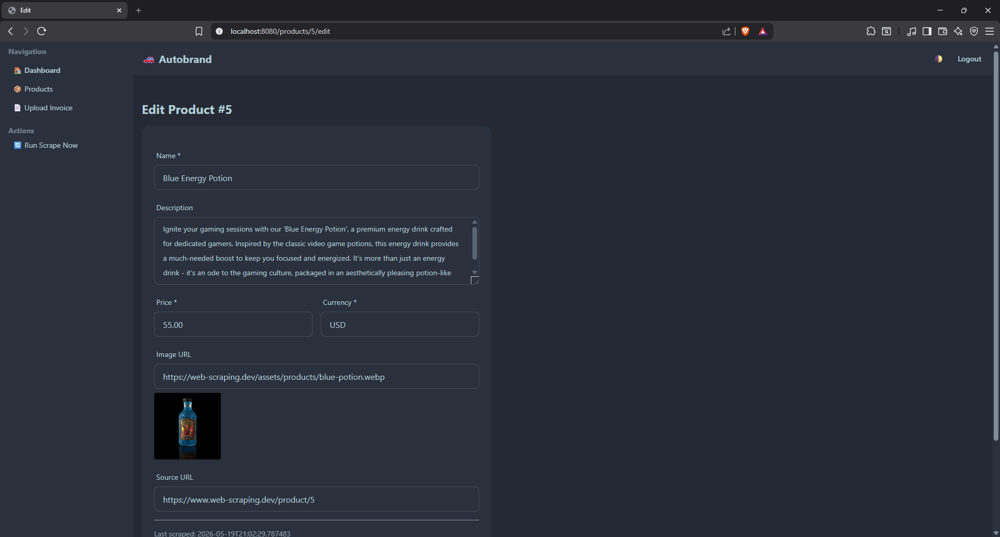
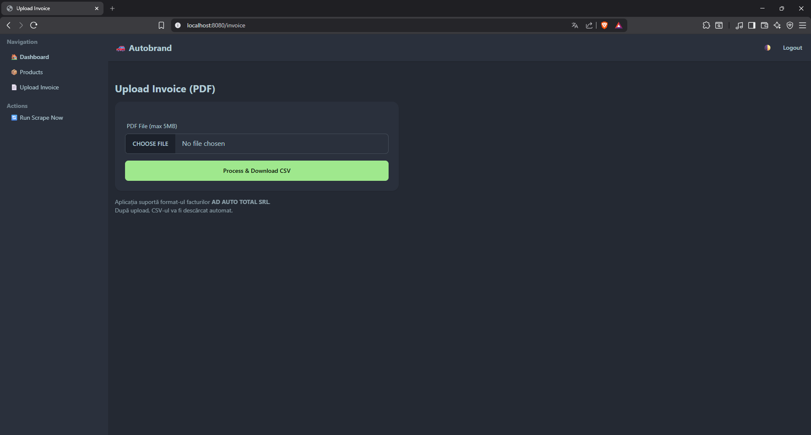
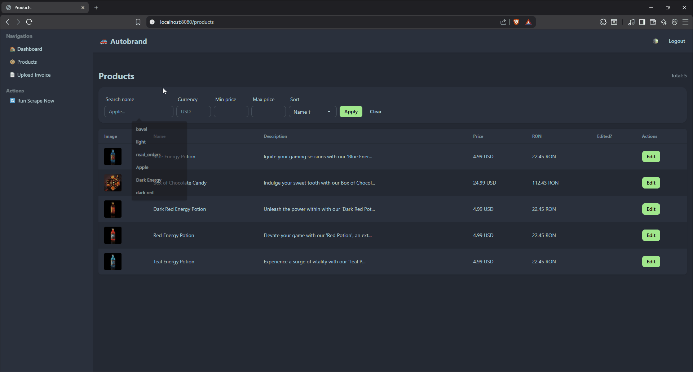

# Proba Practică Autobrand — Boris Pavel

> Rezolvare proba practică pentru poziția **Junior Full Stack Developer** @ Autobrand.

Aplicație Spring Boot care extrage produse de pe [web-scraping.dev](https://www.web-scraping.dev), persistă în PostgreSQL, oferă UI CRUD cu HTMX + Tailwind/DaisyUI, parsează facturi PDF la CSV și gestionează curs valutar BNR pentru conversie RON.

---

## 🔐 Credențiale demo

| Username | Parolă |
|---|---|
| `admin` | `Autobrand2026!` |

---

## 🚀 Pornire rapidă

**Cerință:** Docker Desktop instalat.

```bash
git clone <repo-url>
cd proba-practica-autobrand
docker compose up --build
```

→ http://localhost:8080 (auto-scrape la pornire, login cu credentialele de mai sus)

**Dezvoltare locală:** rulează doar DB-ul în Docker, app-ul din IDE:
```bash
docker compose up -d db
./mvnw spring-boot:run
```

---

## 📋 Funcționalități

### Cerințe principale
- ✅ Login web-scraping.dev (Jsoup cu form POST + cookies)
- ✅ Scraping `/products?category=consumables` (poză, nume, preț, descriere)
- ✅ Cron orar 12:00–18:00 (Spring `@Scheduled`)
- ✅ PostgreSQL cu UNIQUE constraint pe `product.name`
- ✅ Web UI cu **listare / editare / ștergere** produse (Thymeleaf + Tailwind/DaisyUI)
- ✅ Upload PDF factură (Apache PDFBox) → extracție linii → download CSV (Commons CSV cu UTF-8 BOM)

### Bonus
- ✅ **Curs valutar BNR** (fetch XML zilnic, calcul `price_ron` cu multiplier — atenție la JPY ×100)
- ✅ **Filtrare/sortare** server-side cu Specifications + HTMX swap (fără page reload)
- ✅ **Autentificare** Spring Security cu BCrypt + sesiune + DB users

### Extras peste cerință
- 🎁 Dashboard cu stats, Chart.js donut, recent scrape activity
- 🎁 Toggle temă (DaisyUI corporate / dim)
- 🎁 Flag `manually_edited` care protejează editări manuale de overwrite la scraping
- 🎁 Buton "Reset to scraped" pe form editare
- 🎁 Tracking `ScrapeRun` cu lifecycle RUNNING → SUCCESS / FAILED

---

## 🏗️ Stack & Decizii

| Componentă | Alegere | Pe scurt, de ce |
|---|---|---|
| Limbaj | **Java 21 LTS** | LTS curent, records + pattern matching + virtual threads |
| Framework | **Spring Boot 3.5** | Standard Java enterprise; auto-config; ecosystem matur |
| Build | **Maven** | Beginner-friendly, defaults Initializr, ecosistem Spring |
| Persistență | **Spring Data JPA + Hibernate** | Repository pattern; Specifications pentru filter dinamic |
| DB | **PostgreSQL 16** (Docker) | DB modern open-source standard |
| Migrări | **Flyway** | Versionare schemă în git, SQL pur |
| Test DB | **Testcontainers** | Postgres real în container, evită divergențe H2 |
| Templating | **Thymeleaf** | Server-rendering, HTML-valid prototyping |
| CSS | **Tailwind Play CDN + DaisyUI** | Modern, zero build pipeline, teme toggle |
| Interactivitate | **HTMX** | SPA-feel fără React/Vue (Thoughtworks Tech Radar 2024) |
| Scraping | **Jsoup 1.17** | Cel mai simplu pentru HTML server-rendered |
| PDF parsing | **Apache PDFBox 3.x** | Apache 2.0 license (vs. iText AGPL viral) |
| Auth | **Spring Security + BCrypt** | Industry standard, CSRF, session-based |
| Charts | **Chart.js (CDN)** | Donut simplu pentru dashboard |

Document de design complet cu **alternative excluse și interview defenses** pentru fiecare decizie:  
👉 [`docs/superpowers/specs/2026-05-19-autobrand-proba-practica-design.md`](docs/superpowers/specs/2026-05-19-autobrand-proba-practica-design.md)

---

## 🧭 Arhitectură

**Monolit modular** — single Spring Boot app cu packages clare pe responsabilități. Decizia s-a luat conștient peste multi-module Maven (ar fi overkill pentru scope de 1 săptămână).

```
ro.autobrand.proba/
├── config/         # SecurityConfig, SchedulerConfig
├── controller/     # Dashboard, Product, Invoice, Auth, ScrapeAdmin
├── service/        # ScrapingService, ProductService, PdfInvoiceService,
│                   # CsvExportService, ExchangeRateService, AppUserDetailsService
├── repository/     # JPA repositories (Spring Data)
├── model/          # JPA entities (Product, AppUser, ExchangeRate, ScrapeRun)
├── dto/            # ProductDto (validation), ScrapedProductDto, InvoiceLineDto
├── scraper/        # Scraper interface + WebScrapingDevScraper (Jsoup)
├── pdf/            # InvoiceParser interface + AdAutoTotalInvoiceParser
├── specification/  # ProductSpecifications (filter dinamic JPA)
└── exception/      # GlobalExceptionHandler + custom exceptions
```

### Pattern-uri folosite
- **Layered architecture** controller → service → repository → DB
- **Dependency Inversion** prin interfețe (`Scraper`, `InvoiceParser`) — implementări plug-able
- **Specification pattern** pentru queries dinamice
- **Strategy** pentru parser-i de factură per furnizor

---

## 🎬 Demo

### Dashboard



### Products



### Invoice upload


### Live filter HTMX

> Screenshots + GIF-uri în [`docs/screenshots/`](docs/screenshots/) și [`docs/gifs/`](docs/gifs/).

| Imagine | Descriere |
|---|---|
| `dashboard-light.png` | Dashboard cu stats + donut chart |
| `dashboard-dark.png` | Aceeași pagină în tema dim (modern dark) |
| `products-list.png` | Listă produse cu filter HTMX |
| `edit-product.png` | Form editare cu Bean Validation |
| `invoice-upload.png` | Upload PDF + download CSV |
| `scraping-flow.gif` | "Run Scrape Now" → log live → produse populate |
| `htmx-filter.gif` | Filter real-time fără page reload |

---

## 🧪 Testare

```bash
./mvnw test
```

| Tip | Acoperire | Tool |
|---|---|---|
| **Unit (service)** | `ProductService.upsertAll` (manually_edited logic), `CsvExportService`, `AdAutoTotalInvoiceParser` | JUnit 5 + Mockito |
| **Repository slice** | `ProductRepository` cu save/find/UNIQUE constraint | `@DataJpaTest` + Testcontainers Postgres |
| **Scraper** | Parser pe HTML fixture (offline, fără hit pe rețea) | Jsoup + fixture HTML |

---

## 🤔 Decizii notabile

### De ce Thymeleaf + HTMX în loc de React?
React ar fi dublat scope-ul de învățare (Spring + ecosystem JS) și ar fi cerut build pipeline separat. HTMX dă SPA-feel cu DOM swap-uri, server returnează fragmente Thymeleaf, zero JS framework. Pentru web app server-rendered, e mariajul natural.

### De ce Jsoup și nu Selenium?
web-scraping.dev e HTML server-rendered, deci Jsoup ajunge. Selenium ar fi adăugat un browser headless (~2-5s per pagină, ChromeDriver binary, flakiness). Pentru un cron orar, Jsoup ~100ms e victorie clară.

### De ce 2-pass parser pentru PDF?
Factura `AD AUTO TOTAL` are coloane care se lipesc la extracție: `-251.96172812F` (valoare netă + cod produs lipite). Soluția: prima trecere captez codurile din ancorele "Identificator vanzator articol pentru linia N :CODE", a doua trecere folosesc fiecare cod ca pivot fix în regex pe data row. Elimină ambiguitatea boundary.

### De ce flag `manually_edited`?
Vreau ca scraper-ul să NU suprascrie modificările manuale ale utilizatorului. Flag boolean simplu, opțional un buton "Reset to scraped" în UI care îl resetează la false. YAGNI pentru audit log / versioning complex.

### De ce Testcontainers și nu H2?
H2 are dialect ~95% compatibil cu Postgres, dar diverge la `jsonb`, `ILIKE`, funcții array. Risc: test trece pe H2, pică în prod. Testcontainers pornește un container Postgres real (~2s overhead) — same engine ca producția.

---

## 📦 Posibile îmbunătățiri viitoare (out of scope acum)

- CI/CD pipeline (GitHub Actions: `mvn test` + Docker image push)
- Audit log produse (Hibernate Envers)
- Multi-user cu roluri (USER, ADMIN) — schema deja permite
- Retry policy structurat (Spring Retry) pentru BNR fetch + scraping
- Internationalization (i18n) — momentan doar română
- Persistare istoric facturi PDF
- E2E tests cu Playwright pe propriul UI

---

## 📧 Contact

**Boris Pavel**

**email**: borisandreipavel@gmail.com

**telefon**: +40736363919

Submission: `Rezolvare proba practica Boris Pavel` → `hr@autobrand.ro`